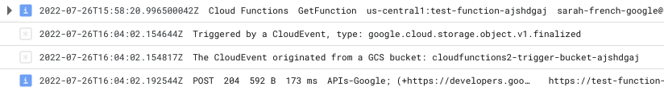

# Example configurations for testing `google_cloudfunctions2_function` resources

## Purpose of this repo

Testing this PR - https://github.com/GoogleCloudPlatform/magic-modules/pull/6278 - which adds the `event_filters` block to the `google_cloudfunctions2_function` resource

To test this PR this you will need to
- Clone magic-modules and checkout the branch from that PR
- Build the provider on your machine using the Makefile
- Use a developer override in your CLI configuration to make Terraform use the local copy of the provider:


```
provider_installation {

  dev_overrides {
    "hashicorp/google-beta" = "/Users/your-username-here/go/bin"
  }

  # For all other providers, install them directly from their origin provider
  # registries as normal. If you omit this, Terraform will _only_ use
  # the dev_overrides block, and so no other providers will be available.
  direct {}
}
```

- Provide GCP credentials to the provider via ENV variables

## Contents

- `config-for-new-gcp-project` directory - see below
- `config-for-existing-test-project` directory - see below
- `test-fixtures` directory - ZIP files for deploying the cloud function, and the code contained by the files
    - `test-fixtures/function-source-eventarc-gcs` contains a JavaScript function that is triggered by cloud events
## Configurations in this repo

This repo contains 2 configurations:
1. configuration for adding a cloud function (+ service accounts, buckets) in an existing project
    - This assumes that APIs are enabled already
2. configuration for a fresh project - creating the same cloud function but also enabling all the required APIs
    - This configuration doesn't make the fresh project, it assumes you start with a freshly provisioned GCP project and pass it's project ID into the config


> Add values for GCP project, region and zone, then run `terraform` commands with the `-var-file=./input-variables.tfvars` flag.


### 1. Configuration for an existing project

`config-for-existing-test-project` directory

- Works, when using the ZIP the config makes using `archive_file` ([docs here](https://registry.terraform.io/providers/hashicorp/archive/latest/docs/data-sources/archive_file))



### 2. Configuration for a new project with no APIs enabled yet

`config-for-new-gcp-project` directory

- Works, when using the ZIP made by config 1

- _Fails_ (function.js does not exist), when using the ZIP made by me in the past
    - `test-fixtures/zip-not-made-by-terraform.zip`
    - Different method of making the .zip - Terraform versus Mac Finder
        - cannot remember how but filesize is larger
